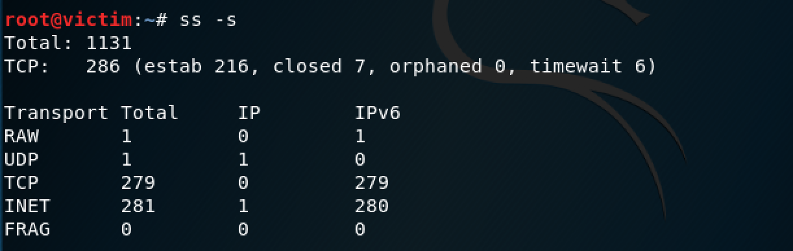
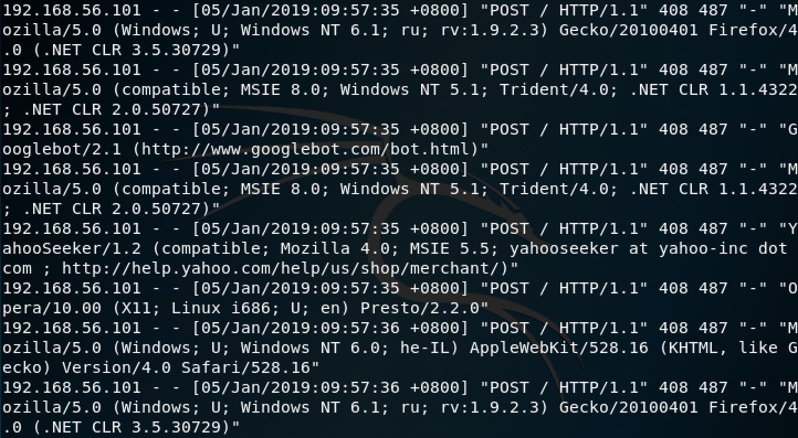
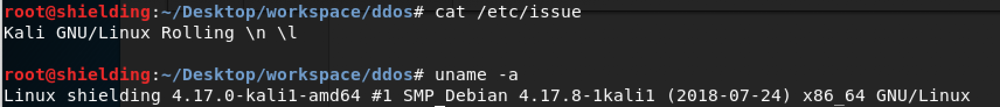
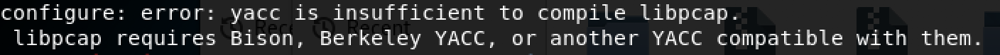
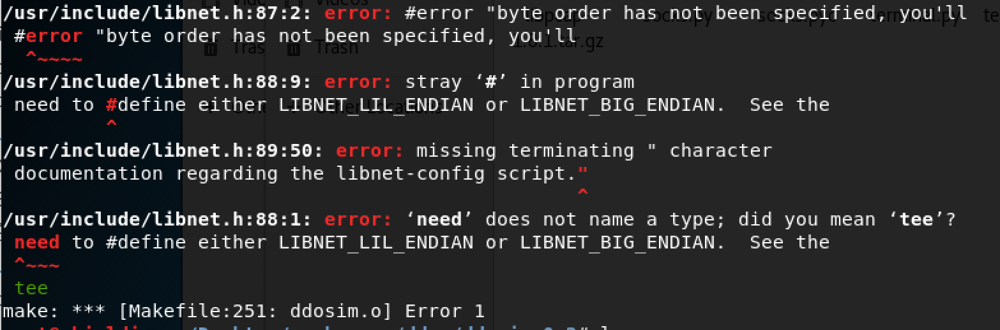
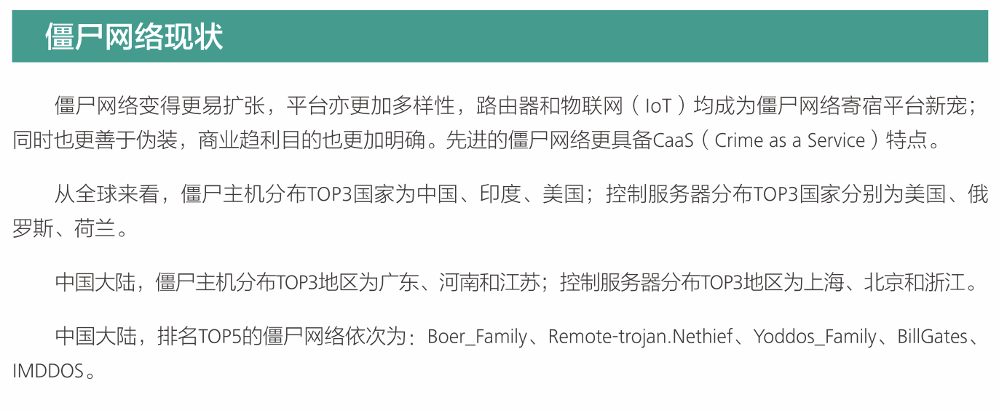
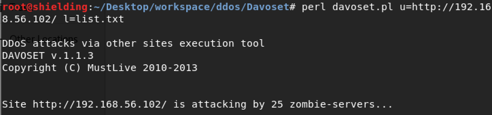

> 基于HTTP协议的Dos/DDos攻击的原理和实验 、如何防御（有效防御包括攻击预防，攻击检测，追踪攻击源并攻击反击)
> 


- [ ] 基于Dos攻击和DDos攻击研究背景

  - Dos攻击和DDos攻击介绍

    Dos攻击的目的是通过耗尽cpu 内存和网络带宽等服务器资源的方法，致使服务器无法为用户提供正常服务或使得服务质量下降。
    DDos（Distributed Denail of Service）攻击又称为分布式拒绝服务攻击，是在Dos攻击基础上进行发展改进的，比Dos攻击危害更大。攻击者首先根据采集到的信息，占领大量的僵尸主机，之后通过数量众多、分布各异的僵尸主机向目标服务器发送攻击数据包，迅速消耗网络和系统资源以达到拒绝服务的攻击效果。

    但不管是Dos还是DDos攻击，其原理都一致，消耗某一种资源使正常服务无法保持。

  - 攻击手段

    拒绝服务攻击根据攻击手段，主要可分为两类：
    -  洪泛攻击，向目标服务器发送大量超过其处理能力的无用数据包从而使目标服务器无法为合法用户提供服务。
    - 利用应程序的设计漏洞，使系统中存在大量处于半连接的请求服务，使服务系统瘫痪。
    	

    其中，基于HTTP协议的Dos攻击，主要有以下两种：

    - HTTP FLOOD 

    	该攻击方法是针对一个web服务器的攻击，攻击者往往会不停地对网页进行语义上合法的请求，不同于连接耗尽攻击仅占用连接资源，HTTP FLOOD 的攻击对象是受害者网站上内存比较大的资源，致使网站频繁的执行cup和内存密集型数据库操作，在现有的几种HTTP FLOOD攻击方式中，CC攻击较为出名。
    - 慢连接攻击
    	​	
    	对于洪泛攻击来说，需要保持高速率的状态，才能达到良好的攻击效果。但是慢连接攻击不同，攻击者利用应用协议的漏洞，使用低速率收发数据包的方式，占用服务器资源，从而让服务器无法响应正常用户的请求。

   - 防御手段

     根据防御时间点的不同，防御手段可分为两大类：

     - 攻击前的预防方法


       对于攻击前的预防，可以从提高服务器性能方面入手，如完善网络协议、应用代码做好性能优化、网络架构做好优化。
    
     - 攻击产生时的检测过滤


       针对不同攻击的在流量速率连接请求数量等区别于正常流量的特征，对攻击进行检测。可以利用特征匹配的方法对攻击进行检测，首先建立一个已知特征数据库，根据检测到的流量是否符合该数据库的特征参数，来判断有无攻击产生。


   	

- [ ] 基于HTTP协议的Dos/DDos攻击种类

   - Slowloris
    - HTTP POST DOS(RUDY)
    - Server Limit DOS
    - CC攻击

    


- [ ] Slowloris 原理、攻击实验及对应防御措施

  - Slowloris 原理

    Slowloris是在2009年由web安全专家RSnake提供的一种攻击方式，原理是以**极低的速度**往服务器端发送**HTTP请求**，HTTP协议规定必须HTTP request必须完整收到以后才能开始处理，所以在HTTP request没有被服务器完全接受之前，服务器会保持该tcp连接。由于服务器的**并发**连接数具有一定的上限，因此恶意占用所有连接不释放会导致服务器无法接受新的请求，导致拒绝服务。

    为了保持恶意连接，RSnake构造一个**不完整**的HTTP请求，服务器认为请求接受不完整，会继续保持tcp连接。当服务器tcp的连接数**达到上限**，就会导致拒绝服务。

  - Slowloris 攻击实验（以apche2服务器为例）

    - 实验环境

    	attacker (kali  + slowhttptest)  `ip 169.254.227.182`
    	victim(apache2 + wireshark)   `ip 169.254.227.283`
    - 实验内容
    	- 首先在attacker上安装slowhttptest,在victim上打开apache2服务
    		`apt install slowhttptest`
    		`service apache2 start`
    	
    	- 查看slowhttptest和apache2版本信息
    		```python
    		#victim上apache2的版本信息
    		apache2 -version
    		Server version: Apache/2.4.34 (Debian)
    		Server built:   2018-07-27T19:37:37
    		
    		#attacker上slowhttptest版本信息
    		slowhttptest version 1.6
    		```
    	
    	- 在attacker使用`slowhttptest -c 500 -H -g -o outputfile -i 10 -r 200 -t GET -u http://169.254.227.183/ -x 24 -p 2` 对victim上的apache2服务进行攻击。
    		
    		```python
    		#参数解释
    		-c 500 = 500 connections
    		 -H   Slowloris mode
    		  -g   Generate statistics
    		  -o outputfile    Output file name
    		  -i 10 wait data 10 seconds
    		   -r 200 200 connections with GET requests
    		   -u url  url to attack
    		   -x 24  data length
    		   -p 2 2 seconds timeout
    		```
    	
    	- 代码开始执行时，屏幕输出显示了攻击状态，刚开始连接数较少时屏幕截图如下,此时连接数较少，服务器仍是可用的，使用浏览器访问`169.254.227.183` 仍能刷新出apache2的首页。
    		
    		
    		
    	- 随着连接数的增加，服务器变为不可用状态，由下图可知当连接数达到293时，服务器已经处于不可用状态，可见victim  apache2服务器最多只能进行293个http连接。
    	此时访问victim`apache2服务`，无响应。
    	
    		

    	- 查看slowhttptest的输出文件，大致的攻击过程和apache2服务器的走势如下，由`图中绿色线条走势`可以看出Slowries的攻击还是很`有效`的。
    		
    		

    	- 在victim中查看wireshark的http抓包数据。
    	 在filter中使用`http and ip.src == 169.254.227.182 and ip.dst == 169.254.227.183`进行过滤。
    	 然后在`statics- capture file properties`中查看过滤数据包信息如下，下图中可看出在victim和attacker的所有通信数据中：
    	 `attacker`发送给`victim`的`http`数据包仅占其中的`0.3%`
    	数据包的传输速率为 `836 bits/s` ，远远低于数据包传输速率的平均水平`104k bits/s`,仅为数据包平均传输速率的`1/127`
    	
    		

  - Slowloris防御实验（以apche2服务器为例）

    - 限制http request header `最小传输速率`。
      以apache2为例，选用apache2的扩展模块`mod_reqtimeout`（Available in Apache HTTPD 2.2.15 and later),设置服务器端接收客户端请求的超时时间，以及`最小传输速率`。

      - 配置 apache2的`mod_reqtimeout`模块参数
      	
      	```python
      		#打开mod_reqtimeout的配置文件
      		vim /etc/apache2/mods-enabled/reqtimeout.conf 
      		
      		#设置http request header 传输超时时间，减弱Slowloris攻击的影响。
      		equestReadTimeout header=10
      		
      		#配置完成后保存退出，重启apache2服务
      	```

      - 配置完成后，在attacker使用`slowhttptest -c 500 -H -g -o outputfile -i 10 -r 200 -t GET -u http://169.254.227.183/ -x 24 -p 2` 对victim进行与之前`完全相同`的攻击。
      	
      - 攻击结束后，查看slowhttptest 的输出文件，如下，`对比之前`的攻击过程可发现:
      	 攻击持续时间从`84s缩短到26s`
      	 攻击的有效时间从`49s缩短到10s`

      	
      	
      - 同样在victim中查看wireshark的http抓包数据.
      在filter中使用`http and ip.src == 169.254.227.182 and ip.dst == 169.254.227.183`进行过滤。然后在`statics- capture file properties`中查看过滤数据包信息:
      发现attacker和victim的通信数据包由`10529`降为`7399`
      `attacker`发送给`victim`的http request仅占`0.2%`

      	

      - 由上面的测试可以看出，适当调整apache2 配置的参数，的确可以缓解Slowloris攻击给apache2服务器带来的影响。

    - 增加服务器端最大连接数，限制`单个ip允许的tcp连接个数`。

      - 使用`mod_qos`模块限制单个ip允许的tcp连接个数。

        - 首先下载并配置`mod_qos`模块

          ```python
          apt search apache-  #首先搜索apache2 相关扩展模块 从输出结果中获取模块名称以后 直接下载
          apt install libapache2-mod-qos   #安装mod_qos 模块
          
          vim  /etc/apache2/mods-enabled/qos.conf  #打开配置文件  进行如下配置
          <IfModule qos_module>
            # minimum request rate (bytes/sec at request reading):
          	QS_SrvRequestRate                                 150 #设置request最低传输速率
            #limits the connections for this virtual host: #设置服务器最多连接个数 
              QS_SrvMaxConn                                     50
              
              #allows keep-alive support till the server reaches 10 connections:
               QS_SrvMaxConnClose                                10 
             #allows max 10 connections from a single ip address:
              QS_SrvMaxConnPerIP                                 10 #设置单个ip 最多的连接数
          </IfModule>
          service  apache2 restart # 重启apache2服务
          ```

        - 上述配置完成以后，在attacker使用`slowhttptest -c 500 -H -g -o outputfile -i 10 -r 200 -t GET -u http://169.254.227.183/ -x 24 -p 2` 对victim上的apache2服务进行攻击。

        - 攻击完成后，查看slowhttptest 输出的攻击结果如下，如图中可以发现slowloris 攻击并未奏效。

          在攻击进行到第4s的时候，此时attacker对应的ip已经`达到了单个ip能建立的最多连接数10`，服务器拒绝attacker继续连接，缓解了slowloris攻击。

          

      - 使用`iptables`限制单个ip允许的tcp连接个数。

        - 使用如下语句也可限制单个ip的连接个数。

          ```python
          iptables -A INPUT -p tcp --syn  -m connlimit --connlimit-above 20 -j REJECT --reject-with tcp-reset
          ```

        ​       配置完成后查看iptables，如下,可见`iptables`中多了一条规则，单个ip的tcp连接最多20个。

        ​	

        -  配置完成后，在attacker使用`slowhttptest -c 500 -H -g -o outputfile -i 10 -r 200 -t GET -u http://169.254.227.183/ -x 24 -p 2` 对victim进行与之前`完全相同`的攻击。 slowhttptest 的输出结果如下,当attacker和victim的连接数达到20个以后，iptables作用规则生效，attacker`无法继续和victim建立连接`，占用victim`连接资源`。

          

      - 检测攻击源并阻止对应ip继续访问

        在配置了`mod_reqtimeout` 后，如果客户端未能在配置的时间内发送标头或正文，则会发送`408 `REQUEST TIME OUT错误。
        ​	基于以上特点，我们可以使用`fail2ban ` 来禁止攻击ip的访问。
        ​	具体原理为： 使用正则（fliter）匹配`log`文件中的`408`错误，使用`iptables`规则禁止 触发了fail2ban对应`jail`的ip对`victim`的访问(10minutes)。
        ​	具体步骤如下：

        - 首先配置fail2ban自定义filter

          ```python
          			vim /etc/fail2ban/filter.d/http-error-dos.conf #打开自定义的过滤文件
          			
          			#添加如下规则
          			# Fail2Ban configuration file
          			[Definition]
          			failregex = <HOST>.* HTTP/.*\" [13456789][1023456789]{2,2}.*
          ```

        - 然后在`jail.local`中添加对应`jail`

          ```pythont
          			vim /etc/fail2ban/jail.local   #打开jail 配置文件
          
          			#添加如下规则
          			[http-error-dos]
          			enabled = true 
          			port = http,https
          			filter = http-error-dos     #设置filter
          			logpath = /var/log/apache2/access.log   #设置监听的log file path
          			maxretry = 20
          			findtime = 100
          			bantime = 600 
          			#action = iptables[name=HTTP, port=http, protocol=tcp] 
          			sudo systemctl enable fail2ban  #打开fail2ban 
           			sudo systemctl restart fail2ban  #重启fail2ban服务
          			
          ```

        - 配置完成以后，在attacker使用`slowhttptest -c 500 -H -g -o outputfile -i 10 -r 200 -t GET -u http://169.254.227.183/ -x 24 -p 2` 对victim进行与之前`完全相同`的攻击。

        - #观察 fail2ban 对应的log文件 观察到触发http-error-dos规则

          ```python
          tail -f /var/log/fail2ban.log
          
           2018-12-26 20:02:28,680 fail2ban.jail           [7619]: INFO    				Jail 'http-error-dos' started
          2018-12-26 20:05:19,478 fail2ban.filter         [7619]: INFO    					[http-error-dos] Found 169.254.227.182 - 2018-12-26 20:05:14
          2018-12-26 20:05:19,479 fail2ban.filter         [7619]: INFO    [http-error-dos] Found 169.254.227.182 - 2018-12-26 20:05:14
          2018-12-26 20:05:19,479 fail2ban.filter 
          			
          ```

        - #查看iptables，发现已经添加了一条对应规则，阻止`attacker`的访问。

          ```python
          				iptables -L
          
          				#输出结果如下
          				Chain INPUT (policy ACCEPT)
          				target     prot opt source               destination         
          				f2b-http-error-dos  tcp  --  anywhere             anywhere             multiport dports http,https
          				
          				Chain FORWARD (policy ACCEPT)
          				target     prot opt source               destination         
          				
          				Chain OUTPUT (policy ACCEPT)
          				target     prot opt source               destination         
          
          				Chain f2b-http-error-dos (1 references)
          				target     prot opt source               destination         
          				REJECT     all  --  169.254.227.182      anywhere             					reject-with icmp-port-unreachable
          				RETURN     all  --  anywhere             anywhere
          ```

        -  攻击结束后，查看slowhttptest 的输出文件，如下，`对比之前`的攻击过程可发现:

          攻击的有效时间很短，随后`attacker`的ip被禁，攻击者攻击不奏效。

          

      - 为什么Slowloris 攻击对Nginx无效 ?

        经过查阅资料和查看nginx的配置，我认为Slowloris 攻击对nginx无效的主要原因有两点（此处使用的`nginx version: nginx/1.14.2`）

        -  [nginx 不依赖于多线程，而是使用更加具有扩展性的事件驱动架构（异步）](https://www.nginx.com/resources/wiki/)，这使得nginx是为数不多的几个可以处理` C10K problem`的其中之一,所以nginx可以处理更多的并发请求。

          在attacker使用`slowhttptest`对victim中的nginx服务进行与之前对`apachee` `完全相同`的攻击,由下图slowhttptest的输出结果可以发现，nginx完全可以`并发处理某个特定ip`的500个 tcp connection。
          ​	

        - nginx没有所谓的`MaxClients`限制，使用 `vim /etc/nginx/nginx.conf`查看nginx配置文件，可以发现虽然 `worker_connections =  768`，是一个固定的数值，但是`worker_processes = auto` ,这就决定了nginx不会有连接数被占满而导致的拒绝服务攻击。

          

 		

- [ ] HTTP POST DOS原理、攻击实验及对应防御措施

  - HTTP POST DOS原理
  	
  	在2010年的OWASP大会上，Wong Onn Chee 和 Tom Brennan 演示了一种`类似于 Slowlories `的攻击方法，作者称之为HTTP POST DOS。
  	原理是在发送HTTP POST数据包时，指定一个非常大的 `content-length`,然后以`很低的速度`发包，以保持住这个连接而不断开。当客户端连接数占用了所有可用的服务器连接以后，就会导致拒绝服务攻击。
  	其攻击的本质也是针对像Apache这种服务器的`MaxClients`的配置参数限制的。

  - HTTP POST DOS 攻击实验和防御实验

    - 实验环境
    	同上文中Slowloris攻击实验
    	attacker (kali  + slowhttptest)  `ip 169.254.227.182`
    	victim(apache2 + wireshark)   `ip 169.254.227.283`

    - 实验内容

      - 在`attacker`中使用`slowhttptest -c 500 -B -g -o my_body_stats -i 10 -r 200 -s 8192 -t POST -u http://169.254.227.183 -x 10 -p 3`对victim 发起攻击。
      刚开始，victim的apache服务处于可用状态
      	
      随后，当连接数达到 316 时，apache服务处于不可用状态。
      	

      - 由于`HTTP POST DOS`和`Slowloris`的攻击思想的相似性，即都使用慢速发送数据包、保持tcp连接以`占用连接数`（而不是真的对服务器端内存资源完全消耗）的攻击方法，因此适用于`Slowloris`的防御手段也适用于`HTTP POST DOS`。具体使用以下三种手段
        - 限制数据包最小发送速率
        - 限制单个ip允许的tcp最大连接数
        - 使用fail2ban阻止可疑ip的访问

        使用和`Slowloris`相同的防御方式，选用apache2的扩展模块`mod_reqtimeout` 、`mod_qos`和`fail2ban` 对HTTP POST DOS进行有效的防御。
        以上配置攻击完成，使用slowhttptest进行攻击，完成后查看输出数据，结果如下,可见`HTTP POST DOS`的攻击`并未生效`。
        

	- torshammer实现http post dos
		
		- 开启apache http服务：
		
		```
		/etc/init.d/apache2 start
		```
		
		- 发起攻击：
		
		```
		./torshammer.py -t 192.168.56.102
		```
		
		- -r 参数可以指定连接数，指定为1000时（注意不要过大，以免实验失控），运行5s后在靶机查看：
		
		```
		ss -s
		```
		
		
		- 而在使用torshammer进行攻击之前
		
		
		
		- 说明攻击成功。还可以通过查看日志确认：
		
		```
		tail -f  /var/log/apache2/access.log
		```
		
		
		
		- 查看apache进程
		
		```
		sudo ps -efl | grep apache2 
		```
		- 在攻击期间从主机访问靶机加载非常慢，而且两台虚拟机都反应迟钝，感受到攻击的效果。
  		​				


- Server Limit DOS

  - 原理
  	
  	
  	web server 对HTTP包头都有长度限制(如apache2服务器中的LimitRequestFieldSize和nginx中的large\_client\_header\_buffers属性，都能限制Http header的长度）,如果客户端发送的http包头超过这个大小，服务器就会返回一个4xx错误。
  	假如攻击者通过XSS攻击，恶意往客户端写入一个超长的cookie，则该客户端在该cookie失效之前，将再无法访问该cookie所在域的任何页面。因为cookie放在http header中发送，如果cookie过长，导致http header过长，服务器拒绝该用户的请求，导致拒绝服务攻击。

   - 防御

   	可以调整通过调整服务器的参数配置，解除对http header的长度限制。

- [ ] CC攻击原理、攻击实验及对应防御措施

  - CC 攻击原理

    对资源消耗较大的页面不断地发起正常的请求，以达到消耗服务端资源的目的。在web服务器中，查询数据库，读写硬盘文件，相对消耗比较多的资源。

    - 攻击方式

      CC攻击方式主要有`三种`，`单主机虚拟多ip地址攻击`，`利用代理服务器群攻击`、`利用僵尸网络攻击`。
      利用代理服务器群或僵尸网络进行攻击的CC模型如下图。


      
    
      - 在单主机攻击方中，攻击者`利用一台主机虚构出多个ip地址`向应用服务器发送请求包，当服务器来不及处理这访问请求时，将导致该页面不能响应正常用户的访问请求。
    
       -  利用代理服务器进行攻击时，攻击者通过攻击主机发送页面访问请求给代理服务器，然后攻击主机可以`立刻断开与代理服务器的本次连接，并马上发送下一次的访问请求`，由于代理服务器接受请求后一定会对服务器的制定页面资源进行访问，所以攻击者主机不必像直接访问服务器那样`维持访问的连接`，因此采用这种方式，`攻击效率会大大提升`。
       -  利用僵尸网络进行攻击时，攻击者通过攻击主机发送指令到僵尸网络，由僵尸网络主机自动发送请求给服务器，当使用一定规模的僵尸网络进行CC攻击时，将会对应用服务器造成巨大的负担，导致服务器瘫痪。同时由于这些攻击流量采用的是`真实`、`不同的ip`，`高度模拟`了 正常用户的访问，因此具有很强的`隐蔽性`。

  - CC攻击特征
      CC攻击具有`低流量`、`模拟用户正常访问`和`采用真实ip地址`进行访问的特征。

      - 首先，与流量型DDos攻击不同，CC攻击针对网站服务器性能弱点，所以可能仅需很小的流量就能达到攻击的效果。

      - 其次不同于基于TCP半开连接或者SYNFlood的攻击，CC攻击是一个正常的请求，具有正常访问的特征，因此很难与正常访问进行区别。

      - 最后，CC攻击一般会利用代理服务器进行攻击，这样攻击来源于不同的真实ip，很难根据用户的ip区分是正常访问还是攻击。


  - CC攻击实验

    - 首先在victim中的mysql服务器中导入了一个数据库，选用了[Employees Sample Database](https://dev.mysql.com/doc/employee/en/)
     导入完成后，查看employees数据库中employees数据表中的记录条数为`300024`，如下：

     

  - 然后在apache的服务器中增加一个对数据库访问的php页面 [rand.php](https://github.com/CUCCS/2018-NS-Group-Public-echo-helloddos/blob/master/source_code/pyflooder.py),功能为：每次产生两个随机字符串，并对employees数据表进行查询。

     其中sql检索语句为`$sql = "select * from employees where first_name = '".$a."' and last_name ='".$b."' order by birth_date desc limit 30";`


     之所以使用随机字符串是因为观察案发现mysql数据库有类似于缓存的功能。同样的语句`第一次执行`和`第二次执行`使用时间不同，如下图。为了达到较好的攻击效果，采取每次查询均使用随机字符串的方法。
     


  - 使用单ip进行CC攻击（以apache服务器为例）

      - 在`attacker`中采用 [HTTP FLOOD](https://github.com/D4Vinci/PyFlooder)的攻击方法（对源码进行[修改](https://github.com/CUCCS/2018-NS-Group-Public-echo-helloddos/blob/master/source_code/pyflooder.py)以访问指定页面），不断对victim的[rand.php](https://github.com/CUCCS/2018-NS-Group-Public-echo-helloddos/blob/master/source_code/pyflooder.py)页面进行访问。对应函数为：

      ```
      def attack():
         print_status()
         url_path = generate_url_path()
      # Create a raw socket   
      dos = socket.socket(socket.AF_INET, socket.SOCK_STREAM)
      
       	  try:      
       	 	        #Open the connection on that raw socket
       	 			dos.connect((ip, port))  
      	      		# Send the request according to HTTP spec
        	   			 dos.send("GET /rand.php HTTP/1.1\r\nHost: 169.254.227.182\r\nUser-Agent: curl/7.61.0\r\nAccept: */*\r\n\r\n")   
        	   			 
       	  except socket.error, e:
       	       	print "\n [ No connection, server may be down ]: " + str(e)
       	  finally:
           			 # Close our socket gracefully
        			dos.shutdown(socket.SHUT_RDWR)
        			dos.close()
      ```
      ```
      
      - 运行 `python pyflooder.py 169.254.227.183 80  10`语句对victim进行攻击(首先对victi发送10个http请求），发送的攻击包如下:
        ​		
      ```


      - 在`victim`中查看`apache access.log `可发现`攻击`的数据包`请求成功`，见下图：
        
    
      - 运行 `python pyflooder.py 169.254.227.183 80  1000`	对`victim`发送`1000次`http [rand.php](https://github.com/CUCCS/2018-NS-Group-Public-echo-helloddos/blob/master/source_code/pyflooder.py)页面请求攻击,发现victim卡死，victim中的apache服务对其他的页面请求`无响应`，拒绝服务攻击完成。
        ​	
    
      - 使用代理服务器群进行CC攻击。
    
        #todo		
    
        首先`victim`配置虚拟机桥接网卡，因为代理ip是真实ip，需要给虚拟机配置一个外界真实ip能访问到的ip.
        ​	搜集可用代理服务器（网上一抓一大把）
        ​	使用[CC-attack](https://github.com/Leeon123/CC-attack)攻击工具对victim进行攻击，不断地访问[rand.php](https://github.com/CUCCS/2018-NS-Group-Public-echo-helloddos/blob/master/source_code/pyflooder.py)。
        ​	

  - CC攻击防御和检测
    - 限制请求频率
    	
    	在应用中为限制每个客户端的请求频率，这种方法对于单ip攻击比较有效，对于代理ip和僵尸网络可能作用不是很大。
    	对于apache2 可采用 `mod_qos`模块。（已在Slowloris中 演示开启方法)
    	对于nginx，可使用如下模块
    	- nginx模块：ngx_http_limit_req_module 限制每秒请求数
    	- nginx模块：ngx_http_limit_conn_module 限制IP连接数

    - 基于网站代码优化的检测方法
    	
    	- 应用代码做好`性能优化`
    		
    		合理使用缓存，将数据库压力尽可能转移到内存中。
    		提高代码性能
    		​	
    		
    	- 采用`cookie认证`主动检测CC攻击
    		
    		采用cookie认证检测CC攻击的原理是，当用户第一次访问某个页面时，在用户的浏览器设置一个cookie值，在随后访问的一段时间内，用户再次访问相同的URL时，必须携带相同的cookie。
    		如果对于服务器的访问是由cookie自动发起的，则在第一次访问完成后的攻击，攻击者很可能不会携带该cookie，服务器可判定此类数据包为攻击数据包。
    		但是如果攻击者分析网站检测CC攻击的方法，并增加保留cookie的功能，该方法将失效。
    	- 通过HTTP_X_FORWARD_FOR变量检测。
    		
    		`代理服务器`在提供代理服务时会通过HTTP中的HTTP_X_FORWARD_FOR变量发送原始用户ip地址，可以根据这个变量`统计原ip的访问频率`，用于判断该ip是否对服务器进行CC攻击，但是这种方法，不适用于僵尸网络。

    - 	基于运营商网络的CC攻击检测方法
    	
    	基于运营商的检测方法，主要依赖于对访问网站的数据流分析。基于正常网络数据流了，可以统计session特点，生成网站不同URL访问量分布模型，如果某段时间的session或网站URL访问和模型差值超过`阈值`，可判定网站正在遭受CC攻击。
    	
    	
    	​		

    - 网络架构做好优化
    	​	
    	善用利用`负载均衡分流`，避免单台服务器承受较大流量，充分利用CDN和镜像站点的分流作用。	
    	​				  
### 其它工具简介 

- DDOSIM 【排雷】
	
	- 推荐的ddos工具中DDOSIM出现的频率很高，简单介绍一下：Storm Security的这个工具使用随机IP地址模拟来自各种僵尸的DDoS攻击。它尝试创建完整的TCP连接（SYN-SYN / ACK-ACK）。它的全名叫：DDOSIM - Layer 7 DDoS Simulator，顾名思义，它在应用层（第7层）运行。它还能够模拟SMTP服务器上的DDoS攻击和随机端口的TCP泛洪。
	
	- 听起来很不错，但是不建议尝试。实验环境如下：
	
		
	
	- 失败的步骤如下：
	
		* 错误1: 
	
		
	
		* 因为apt-get没有用，所以手动下载安装yacc或者bison，比如可以在www.tcpdump.org/手动下载相关文件。
	
		```
		tar -zxvf XXXXX.tar.gz
		cd XXXXX
		./configure && make && make install
		```
		* 错误2: 
		
		
		
		* 注意，此处需要的是libnet0不是现在的libnet，是很老的版本，所以安装了libnet也没用。libnet0可以从下面的链接下载：
		* [libnet0下载地址](https://launchpad.net/ubuntu/+archive/primary/+sourcefiles/libnet0/1.0.2a-7/libnet0_1.0.2a.orig.tar.gz)
		
		* 终于，错误3:
		
		
	  
	   * 到此为止吧，像我一样对makefile和c程序没有那么了解的小伙伴，请放弃这一老旧的工具吧。

- Davoset模拟僵尸网络

	- 先看一个15年的报告，可见“僵尸网络”很普遍：
	
		
	
	- Davoset工具非常方便，只要有perl环境就可以运行，模拟僵尸网络的攻击：
	
		
		
		* 注意，工具自带的list.txt作为发起攻击的代理可以直接使用，但需要先手动删除一些不可能成功的，比如包含google的。
		
	- Davoset的特点为：
	  * 利用代理发动攻击，一定程度上可以隐藏自身
	
	  * 不定期更新可用的反射点
	
	  * 反射点通常有较强的可交互性，容易绕过目标防护措施

###  小结 

	拒绝服务攻击的本质实际就是一种“资源耗尽”攻击，因此在设计系统时：
	
	1. 应【避免有限资源被恶意滥用】的情况，如通过设置防火墙规则等
	2. 【增加可用资源】，比如一些付费防DDos服务会在受攻击时【迅速增加服务器】并【负载均衡】

- [ ] 参考资料

  - [https://www.tutorialspoint.com/kali_linux/kali_linux_stressing_tools.htm](https://www.tutorialspoint.com/kali_linux/kali_linux_stressing_tools.htm)
  - [DoS website using slowhttptest in Kali Linux – slowloris, slow HTTP POST and slow Read attack in one tool](https://www.blackmoreops.com/2015/06/07/attack-website-using-slowhttptest-in-kali-linux/)
  - [wiki Slowloris (computer security)](https://en.wikipedia.org/wiki/Slowloris_(computer_security)#Mitigating_the_Slowloris_attack)
  - [Apache Module mod_reqtimeout](https://httpd.apache.org/docs/2.4/mod/mod_reqtimeout.html)
  - [[Blocking slowloris using fail2ban, what are the correct parameters?](https://security.stackexchange.com/questions/155941/blocking-slowloris-using-fail2ban-what-are-the-correct-parameters)](https://security.stackexchange.com/questions/155941/blocking-slowloris-using-fail2ban-what-are-the-correct-parameters)
  - [[Why are NginX and Lighttpd not affected by Slowloris?](https://serverfault.com/questions/281581/why-are-nginx-and-lighttpd-not-affected-by-slowloris)](https://serverfault.com/questions/281581/why-are-nginx-and-lighttpd-not-affected-by-slowloris/281595#281595)
  - [How To Mitigate Slow HTTP DoS Attacks in Apache HTTP Server](https://www.acunetix.com/blog/articles/slow-http-dos-attacks-mitigate-apache-http-server/)
  - [slowloris.py - Simple slowloris in Python](https://github.com/gkbrk/slowloris)
  - [HTTP Slow Attack 科普和 Apache DOS 漏洞的修复](http://www.it610.com/article/5765081.htm)
  - [Protect Apache Against DOS](https://serverfault.com/questions/814177/protect-apache-against-dos)
  - [NGINX Wiki - The C10K problem](http://www.kegel.com/c10k.html#books)
  - [goloris attack tool](https://github.com/valyala/goloris)
  - [正向代理与反向代理的区别](https://www.jianshu.com/p/208c02c9dd1d)
  - [CC攻击和防御](https://cangshui.net/?p=2028#CC)
  - [DDOSIM-Layer 安装和使用](https://blog.csdn.net/qq_26769591/article/details/85613415)
  - [从程序详解拒绝服务攻击](https://blog.csdn.net/lcgweb/article/details/26279027)
  - [Dos和DDos攻击，以及使用工具](https://www.jianshu.com/p/24d16d3a111e)
  - [2015僵尸网络与DDoS攻击](http://www.doc88.com/p-5843118365547.html)
  - [绿盟科技威胁分析报告 ——DDoS兵器谱2014Q2版](https://www.freebuf.com/articles/network/39443.html)